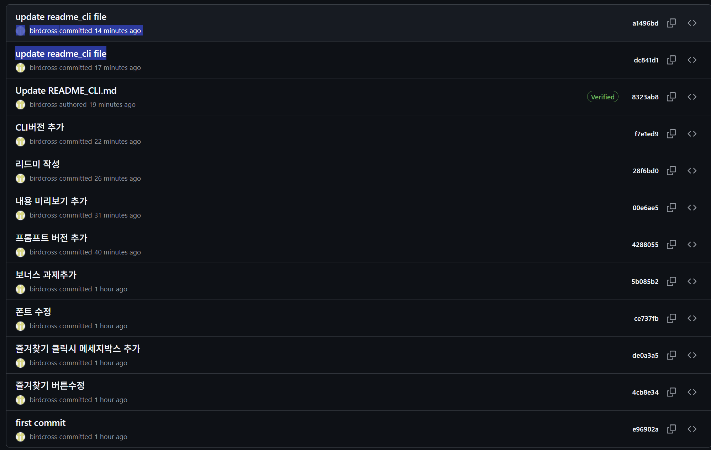

# 나만의 프롬프트 관리 (Prompt Manager - CLI)

생성형 AI를 사용하면서 쌓이는 다양한 프롬프트를 한곳에서 등록하고 검색하며 관리할 수 있는 **Python 콘솔 기반 프롬프트 관리 프로그램**입니다.

터미널에서 메뉴 번호를 입력하여 기능을 선택하는 방식으로 동작하며, 프롬프트 추가, 목록 조회, 카테고리별 조회, 검색, 상세 보기, 즐겨찾기 기능을 제공합니다.

기본 과제 기능에 더해 JSON 파일을 이용한 영구 저장, 프롬프트 수정·삭제, 조회수 기록, 조회수 TOP 정렬, 카테고리별 Markdown 내보내기 기능까지 추가했습니다.

---

## 1. 프로젝트 소개

생성형 AI를 활용하다 보면 잘 작동했던 프롬프트가 메모장, 문서, 메신저, ChatGPT 대화 기록 등에 흩어져 필요한 순간에 다시 찾기 어려운 경우가 많습니다.

이 프로젝트는 이러한 문제를 해결하기 위해 프롬프트를 하나의 프로그램 안에서 체계적으로 관리할 수 있도록 제작했습니다.

Python의 기본 문법인 다음 요소를 실제 프로그램에 적용했습니다.

* 변수
* 리스트
* 딕셔너리
* 조건문
* 반복문
* 함수
* 파일 입출력
* 예외 처리

또한 Git과 GitHub를 이용하여 기능 단위로 개발하고 변경 이력을 관리할 수 있도록 구성했습니다.

---

## 2. 개발 환경

| 항목               | 내용                 |
| ---------------- | ------------------ |
| Language         | Python 3.10 이상     |
| Interface        | CLI / Console      |
| Data             | JSON               |
| Editor           | Visual Studio Code |
| Version Control  | Git / GitHub       |
| OS               | Windows            |
| External Library | 없음                 |

사용한 모듈은 모두 Python 기본 라이브러리입니다.

```python
import json
import os
import re
```

별도의 외부 패키지 설치 없이 실행할 수 있습니다.

프로그램은 **Python 3.10 이상** 환경에서 실행하는 것을 기준으로 합니다.

---

## 3. 실행 화면

프로그램을 실행하면 다음과 같은 메뉴가 출력됩니다.

```text
============================================================
              나만의 프롬프트 관리
============================================================
1. 프롬프트 추가
2. 프롬프트 목록
3. 카테고리별 조회
4. 프롬프트 검색
5. 프롬프트 상세 보기
6. 즐겨찾기 관리
7. 즐겨찾기 목록
8. 프롬프트 수정
9. 프롬프트 삭제
10. 조회수 TOP 목록
11. Markdown 내보내기
0. 종료
============================================================
선택:
```

사용자는 원하는 메뉴 번호를 입력하여 기능을 사용할 수 있습니다.

잘못된 번호를 입력해도 프로그램이 종료되지 않고 다시 입력할 수 있도록 처리했습니다.

```text
선택: 15

잘못된 번호입니다. 다시 선택해주세요.
```

---

## 4. 주요 기능

### 4.1 기본 프롬프트 데이터

프로그램 시작 시 테스트 및 사용을 위한 기본 프롬프트가 등록되어 있습니다.

각 프롬프트는 다음 데이터를 가집니다.

```python
{
    "title": "블로그 글 작성 도우미",
    "content": "당신은 10년 경력의 전문 블로거입니다...",
    "category": "텍스트 생성",
    "favorite": True,
    "views": 0
}
```

프롬프트 전체 데이터는 리스트 안에 여러 개의 딕셔너리를 저장하는 형태로 관리합니다.

각 필드는 다음과 같이 접근할 수 있습니다.

```python
print(prompt["title"])
print(prompt["content"])
print(prompt["category"])
print(prompt["favorite"])
print(prompt["views"])
```

---

### 4.2 프롬프트 추가

메뉴에서 `1. 프롬프트 추가`를 선택하여 새로운 프롬프트를 등록할 수 있습니다.

입력 항목:

* 제목
* 내용
* 카테고리

제목이나 내용이 비어 있을 경우 다시 입력하도록 처리했습니다.

```python
def input_not_empty(message):
    while True:
        value = input(message).strip()

        if value:
            return value

        print("값을 입력해주세요.")
```

카테고리는 다음 목록에서 선택할 수 있습니다.

```text
1) 텍스트 생성
2) 이미지 생성
3) 영상 생성
4) 페르소나
5) 자동화
6) 기타
7) 직접 입력
```

새로 추가한 프롬프트의 기본값은 다음과 같습니다.

```python
"favorite": False
"views": 0
```

카테고리 번호는 허용된 범위만 입력할 수 있도록 검증하며, 직접 입력을 선택한 경우 빈 문자열은 허용하지 않습니다.

---

### 4.3 중복 제목 처리

동일한 제목의 프롬프트가 반복해서 등록되면 목록에서 프롬프트를 구분하기 어려울 수 있습니다.

따라서 프롬프트 등록 시 기존 프롬프트의 제목과 비교하여 **중복 제목을 검사하는 방식**을 사용할 수 있습니다.

비교할 때는 앞뒤 공백을 제거하고 영문 대소문자를 구분하지 않습니다.

```python
while True:
    title = input_not_empty("제목: ")

    duplicate = any(
        prompt["title"].strip().lower() == title.strip().lower()
        for prompt in prompts
    )

    if duplicate:
        print("이미 존재하는 제목입니다. 다른 제목을 입력해주세요.")
    else:
        break
```

예를 들어 다음 입력은 동일한 제목으로 판단할 수 있습니다.

```text
Python 코드 설명
python 코드 설명
 Python 코드 설명
```

중복 제목이 발견되면 다음과 같이 안내합니다.

```text
이미 존재하는 제목입니다. 다른 제목을 입력해주세요.
```

이를 통해 동일한 프롬프트가 반복 등록되는 것을 방지할 수 있습니다.

---

### 4.4 프롬프트 목록

메뉴에서 `2. 프롬프트 목록`을 선택하면 저장된 전체 프롬프트를 확인할 수 있습니다.

예시:

```text
=== 프롬프트 목록 ===

1. [텍스트 생성] 블로그 글 작성 도우미 ⭐ (조회수: 3)
2. [이미지 생성] 제품 썸네일 생성 (조회수: 1)
3. [페르소나] IT 컨설턴트 페르소나 (조회수: 0)

총 3개의 프롬프트
```

각 프롬프트의 다음 정보를 확인할 수 있습니다.

* 번호
* 카테고리
* 제목
* 즐겨찾기 여부
* 조회수

---

### 4.5 카테고리별 조회

메뉴에서 `3. 카테고리별 조회`를 선택하면 카테고리를 선택할 수 있습니다.

```text
=== 카테고리별 조회 ===

1) 텍스트 생성
2) 이미지 생성
3) 영상 생성
4) 페르소나
5) 자동화
6) 기타

선택: 1
```

선택한 카테고리에 포함된 프롬프트만 출력합니다.

```python
for prompt in prompts:
    if prompt["category"] == category:
        print(prompt["title"])
```

해당 카테고리에 프롬프트가 없는 경우 별도의 안내 메시지를 출력합니다.

카테고리 직접 입력 시 `strip()`을 사용하여 앞뒤 공백을 제거하고 빈값 입력을 방지합니다.

---

### 4.6 프롬프트 검색

메뉴에서 `4. 프롬프트 검색`을 선택하면 키워드를 입력할 수 있습니다.

검색 대상:

* 프롬프트 제목
* 프롬프트 내용

검색 시 사용자가 입력한 검색어와 프롬프트의 제목 및 내용을 소문자로 변환하기 때문에 **영문 대소문자를 구분하지 않습니다.**

또한 완전히 동일한 문장이 아니더라도 검색어가 포함되어 있으면 검색되는 **부분 일치 검색** 방식입니다.

```python
keyword = input("검색어: ").strip().lower()

if (
    keyword in prompt["title"].lower()
    or keyword in prompt["content"].lower()
):
    print(prompt["title"])
```

예를 들어:

```text
제목: Python 블로그 작성
검색어: blog
```

영문 대소문자를 구분하지 않기 때문에 검색 조건에 따라 일치 여부를 판단할 수 있습니다.

현재 버전에서는 복잡도를 낮추기 위해 정규식 검색보다는 일반적인 부분 일치 검색을 기본 방식으로 사용합니다.

검색 예시:

```text
=== 프롬프트 검색 ===

검색어: 블로그

검색 결과:
1. [텍스트 생성] 블로그 글 작성 도우미 ⭐ (조회수: 3)

1개의 프롬프트를 찾았습니다.
```

---

### 4.7 프롬프트 상세 보기

메뉴에서 `5. 프롬프트 상세 보기`를 선택한 후 프롬프트 번호를 입력하면 전체 내용을 확인할 수 있습니다.

```text
=== 프롬프트 상세 보기 ===

번호 입력: 1

------------------------------------------------------------
제목: 블로그 글 작성 도우미
카테고리: 텍스트 생성
즐겨찾기: ⭐
조회수: 4회
------------------------------------------------------------
내용:
당신은 10년 경력의 전문 블로거입니다.
주어진 주제에 대해 SEO에 최적화된 블로그 글을 작성해주세요.
------------------------------------------------------------
```

상세 보기를 실행할 때마다 해당 프롬프트의 조회수가 `1` 증가합니다.

```python
prompt["views"] += 1
```

조회수 증가 후 JSON 저장 기능을 호출하여 변경된 값이 유지되도록 구성할 수 있습니다.

---

### 4.8 즐겨찾기 관리

메뉴에서 `6. 즐겨찾기 관리`를 선택한 뒤 프롬프트 번호를 입력하면 즐겨찾기를 추가하거나 해제할 수 있습니다.

```python
prompt["favorite"] = not prompt.get("favorite", False)
```

즐겨찾기 추가:

```text
'제품 썸네일 생성' 프롬프트를 즐겨찾기에 추가했습니다!
```

즐겨찾기 해제:

```text
'제품 썸네일 생성' 프롬프트의 즐겨찾기를 해제했습니다!
```

즐겨찾기 상태를 변경한 뒤 JSON 파일에 다시 저장하여 프로그램을 종료한 후에도 변경 상태가 유지됩니다.

---

### 4.9 즐겨찾기 목록

메뉴에서 `7. 즐겨찾기 목록`을 선택하면 즐겨찾기로 지정한 프롬프트만 확인할 수 있습니다.

```python
if prompt.get("favorite", False):
    print(prompt["title"])
```

예시:

```text
=== 즐겨찾기 목록 ===

1. [텍스트 생성] 블로그 글 작성 도우미 ⭐ (조회수: 4)
4. [자동화] 뉴스 요약 프롬프트 ⭐ (조회수: 2)

총 2개의 즐겨찾기
```

---

## 5. 보너스 기능

### 5.1 JSON 영구 저장

프롬프트 데이터는 다음 파일에 저장합니다.

```text
prompts.json
```

따라서 프로그램을 종료한 뒤 다시 실행해도 다음 정보가 유지됩니다.

* 제목
* 내용
* 카테고리
* 즐겨찾기 여부
* 조회수

JSON 예시:

```json
[
    {
        "title": "블로그 글 작성 도우미",
        "content": "당신은 10년 경력의 전문 블로거입니다...",
        "category": "텍스트 생성",
        "favorite": true,
        "views": 4
    }
]
```

#### JSON을 선택한 이유

본 프로젝트는 개인이 사용하는 소규모 CLI 프로그램이므로 데이터베이스 서버까지 구성하는 것은 과도하다고 판단했습니다.

JSON의 장점은 다음과 같습니다.

* Python의 리스트와 딕셔너리 구조를 그대로 표현하기 쉽습니다.
* 사람이 직접 파일을 열어 내용을 확인할 수 있습니다.
* Python 기본 라이브러리인 `json`만으로 사용할 수 있습니다.
* 별도의 데이터베이스 설치가 필요하지 않습니다.
* 프로젝트 파일과 함께 관리하기 쉽습니다.

대안으로 CSV 또는 SQLite를 사용할 수도 있습니다.

CSV는 단순한 표 형태의 데이터에는 적합하지만 프롬프트 내용에 줄바꿈이나 특수문자가 포함될 경우 관리가 복잡해질 수 있습니다.

SQLite는 데이터가 많아질 경우 검색과 관리에 유리하지만 현재 프로젝트 규모에서는 JSON보다 구조가 복잡합니다.

JSON 방식의 한계는 여러 프로그램이 동시에 같은 파일을 수정하는 환경에서는 동시성 문제가 발생할 수 있다는 점입니다.

따라서 현재 프로젝트에서는 JSON을 사용하고, 향후 데이터가 증가하거나 다중 사용자 환경이 필요해지면 SQLite 또는 별도의 데이터베이스로 전환할 수 있습니다.

---

### 5.2 프롬프트 수정

메뉴에서 `8. 프롬프트 수정`을 선택하여 기존 프롬프트의 정보를 수정할 수 있습니다.

수정 가능 항목:

* 제목
* 내용
* 카테고리

수정하지 않을 항목은 Enter 키를 눌러 기존 값을 그대로 유지합니다.

예:

```python
title = input(f"제목 [{prompt['title']}]: ").strip()
content = input(f"내용 [{prompt['content']}]: ").strip()
category = input(f"카테고리 [{prompt['category']}]: ").strip()

if title:
    prompt["title"] = title

if content:
    prompt["content"] = content

if category:
    prompt["category"] = category

save_prompts()
```

즉 수정 과정은 다음 순서로 이루어집니다.

```text
프롬프트 선택
    ↓
현재 값 출력
    ↓
새로운 값 입력
    ↓
입력값이 있으면 변수 변경
    ↓
JSON 파일 저장
```

이를 통해 카테고리를 변경한 경우에도 변경된 값이 `prompt["category"]`에 반영되고 JSON 파일에 저장됩니다.

---

### 5.3 프롬프트 삭제

메뉴에서 `9. 프롬프트 삭제`를 선택하면 원하는 프롬프트를 삭제할 수 있습니다.

삭제 전 확인 절차를 거칩니다.

```text
'제품 썸네일 생성' 프롬프트를 정말 삭제하시겠습니까? (y/n):
```

`y`를 입력한 경우에만 삭제합니다.

---

### 5.4 조회수 TOP 목록

메뉴에서 `10. 조회수 TOP 목록`을 선택하면 상세 보기를 많이 한 프롬프트부터 정렬해서 보여줍니다.

```python
sorted_prompts = sorted(
    prompts,
    key=lambda prompt: prompt.get("views", 0),
    reverse=True
)
```

예시:

```text
=== 조회수 TOP 목록 ===

1위. [텍스트 생성] 블로그 글 작성 도우미 ⭐ - 조회수 8회
2위. [자동화] 뉴스 요약 프롬프트 ⭐ - 조회수 5회
3위. [이미지 생성] 제품 썸네일 생성 - 조회수 2회
```

---

### 5.5 Markdown 내보내기

메뉴에서 `11. Markdown 내보내기`를 선택하면 전체 프롬프트를 카테고리별 Markdown 파일로 저장합니다.

```text
export_markdown/
```

예시:

```text
export_markdown/
├─ 텍스트 생성.md
├─ 이미지 생성.md
├─ 영상 생성.md
├─ 페르소나.md
├─ 자동화.md
└─ 기타.md
```

각 Markdown 파일에는 다음 정보가 포함됩니다.

* 제목
* 카테고리
* 즐겨찾기 여부
* 조회수
* 프롬프트 전체 내용

---

## 6. 프로그램 종료 및 예외 처리

메뉴에서 `0. 종료`를 입력하면 프로그램이 종료됩니다.

```text
선택: 0

프로그램을 종료합니다.
```

프로그램 종료 전 필요한 데이터 변경사항은 JSON 파일에 저장합니다.

파일 입출력은 `with open()` 방식을 이용하기 때문에 파일 사용이 끝나면 자동으로 닫힙니다.

예:

```python
with open("prompts.json", "w", encoding="utf-8") as file:
    json.dump(prompts, file, ensure_ascii=False, indent=4)
```

잘못된 번호를 입력한 경우 프로그램이 종료되지 않고 다시 메뉴를 보여줍니다.

```text
선택: 20

잘못된 번호입니다. 다시 선택해주세요.
```

숫자가 아닌 값을 입력하거나 허용 범위를 벗어난 번호를 입력할 경우에도 예외 처리를 통해 프로그램이 비정상 종료되지 않도록 구성합니다.

---

## 7. 프로젝트 구조

프로젝트 구조는 다음과 같습니다.

```text
Python-Git-base/
│
├─ main.py
├─ prompt_manager.py
├─ prompts.json
├─ README.md
├─ README_CLI.md
│
└─ export_markdown/
   ├─ 텍스트 생성.md
   ├─ 이미지 생성.md
   ├─ 영상 생성.md
   ├─ 페르소나.md
   ├─ 자동화.md
   └─ 기타.md
```

`prompts.json`은 데이터 저장에 사용하며 `export_markdown` 폴더는 Markdown 내보내기 기능을 실행하면 생성됩니다.

---

## 8. 실행 방법

### 8.1 Python 버전 확인

```bash
python --version
```

실행 환경은 Python 3.10 이상을 권장합니다.

예:

```text
Python 3.14.7
```

---

### 8.2 프로그램 실행

```bash
python main.py
```

또는 실제 실행 파일이 `prompt_manager.py`인 경우:

```bash
python prompt_manager.py
```

실행 후 정상적으로 메뉴가 출력되면 프로그램이 정상적으로 실행된 것입니다.

---

## 9. 코드 구조

모든 기능을 하나의 함수에 작성하지 않고 기능별 함수로 분리했습니다.

| 함수                   | 역할                       |
| -------------------- | ------------------------ |
| `show_menu()`        | 프로그램의 메인 메뉴를 출력          |
| `add_prompt()`       | 새로운 프롬프트를 입력받아 등록        |
| `show_list()`        | 전체 프롬프트 목록 출력            |
| `show_by_category()` | 선택한 카테고리의 프롬프트만 출력       |
| `search_prompt()`    | 제목과 내용에서 검색어 검색          |
| `show_detail()`      | 프롬프트 전체 내용 및 조회수 표시      |
| `manage_favorite()`  | 즐겨찾기 추가 및 해제             |
| `show_favorites()`   | 즐겨찾기 프롬프트 목록 출력          |
| `edit_prompt()`      | 기존 프롬프트 정보 수정            |
| `delete_prompt()`    | 선택한 프롬프트 삭제              |
| `show_top()`         | 조회수를 기준으로 프롬프트 정렬        |
| `export_markdown()`  | 카테고리별 Markdown 파일 생성     |
| `load_prompts()`     | JSON 파일에서 데이터 불러오기       |
| `save_prompts()`     | 현재 데이터를 JSON 파일에 저장      |
| `main()`             | 메뉴 반복 실행 및 전체 프로그램 흐름 관리 |

프로그램의 반복 실행은 `main()` 함수에서 관리합니다.

```python
def main():
    while True:
        show_menu()
        choice = input("선택: ").strip()

        if choice == "0":
            print("프로그램을 종료합니다.")
            break
```

프로그램 실행 시작점은 다음과 같습니다.

```python
if __name__ == "__main__":
    main()
```

---

## 10. 데이터 구조 설계

프롬프트는 **List와 Dictionary를 조합**하여 관리합니다.

```python
prompts = [
    {
        "title": "블로그 글 작성 도우미",
        "content": "당신은 10년 경력의 전문 블로거입니다...",
        "category": "텍스트 생성",
        "favorite": True,
        "views": 3
    },
    {
        "title": "제품 썸네일 생성",
        "content": "다음 제품의 매력적인 썸네일 이미지를 생성해주세요...",
        "category": "이미지 생성",
        "favorite": False,
        "views": 1
    }
]
```

### List 사용 이유

여러 개의 프롬프트를 순서대로 관리하기 위해 List를 사용했습니다.

#### 장점

* `append()`를 이용하여 새로운 데이터를 쉽게 추가할 수 있습니다.
* 반복문을 이용하여 전체 프롬프트를 조회하기 쉽습니다.
* 데이터 순서를 유지할 수 있습니다.
* 소규모 프로그램에서 구조가 단순하고 이해하기 쉽습니다.

#### 단점

* 특정 프롬프트를 찾으려면 리스트를 순차적으로 검색해야 합니다.
* 데이터가 많아질수록 검색 속도가 떨어질 수 있습니다.
* 특정 데이터를 수정하거나 삭제하기 전에 먼저 해당 데이터를 찾아야 합니다.

### Dictionary 사용 이유

프롬프트 하나의 여러 속성을 하나의 데이터로 묶어 관리하기 위해 Dictionary를 사용했습니다.

#### 장점

* Key 이름을 통해 데이터의 의미를 쉽게 알 수 있습니다.
* 원하는 필드에 직접 접근할 수 있습니다.
* 새로운 속성을 추가하기 쉽습니다.

예:

```python
print(prompt["title"])
print(prompt["category"])

prompt["favorite"] = True
prompt["views"] += 1
```

#### 단점

* 프로그램 전체에서 Key 이름을 일정하게 유지해야 합니다.
* Key 이름을 변경하면 해당 Key를 사용하는 코드도 함께 수정해야 합니다.
* 데이터 구조가 복잡해질 경우 관리해야 하는 필드가 많아집니다.

현재 프로젝트에서는 데이터 규모가 크지 않고 구조의 가독성이 중요하기 때문에 List와 Dictionary의 조합을 선택했습니다.

---

## 11. 입력값 검증

프로그램이 잘못된 입력으로 종료되지 않도록 입력값을 검증합니다.

### 빈값 검증

```python
title = input_not_empty("제목: ")
content = input_not_empty("내용: ")
```

제목 또는 내용이 비어 있으면 다시 입력하도록 합니다.

### 숫자 범위 검증

메뉴 및 카테고리 선택 시 허용된 번호 범위인지 확인합니다.

```python
if choice not in ["0", "1", "2", "3", "4", "5"]:
    print("잘못된 번호입니다.")
```

### 문자열 정리

입력값 앞뒤에 불필요한 공백이 포함되지 않도록 `strip()`을 사용합니다.

```python
keyword = input("검색어: ").strip()
```

현재 프로그램에서는 프롬프트의 특성상 내용 길이에 별도의 제한을 두지 않습니다.

다만 제목, 내용 및 직접 입력 카테고리는 빈 문자열을 허용하지 않습니다.

---

## 12. 구현 기능 체크

### 필수 과제

* [x] Python 3.10 이상
* [x] 콘솔 기반 프로그램
* [x] 메뉴 번호 입력 방식
* [x] 잘못된 번호 입력 처리
* [x] 프로그램 종료 기능
* [x] 기본 프롬프트 3개 이상
* [x] 리스트 / 딕셔너리 사용
* [x] 프롬프트 추가
* [x] 프롬프트 전체 목록
* [x] 카테고리별 조회
* [x] 제목 / 내용 검색
* [x] 프롬프트 상세 보기
* [x] 즐겨찾기 추가 / 해제
* [x] 즐겨찾기 목록
* [x] 기능별 함수 분리
* [x] 외부 라이브러리 미사용

### 보너스 과제

* [x] JSON 데이터 저장
* [x] JSON 데이터 불러오기
* [x] 카테고리별 Markdown 내보내기
* [x] 프롬프트 수정
* [x] 프롬프트 삭제
* [x] 상세 보기 조회수 기록
* [x] 조회수 TOP 목록

---

## 13. Git / GitHub

프로젝트는 Git과 GitHub를 이용해 변경 이력을 관리합니다.

GitHub Repository:

```text
https://github.com/birdcross/Python-Git-base
```

### Git 초기 설정

Git 설치 여부를 확인합니다.

```bash
git --version
```

사용자 정보를 설정합니다.

```bash
git config --global user.name "birdcross"
git config --global user.email "example@email.com"
git config --global init.defaultBranch main
```

실제 사용 시 이메일 주소는 본인의 GitHub 계정 이메일로 설정합니다.

### Git 저장소 생성

```bash
git init
git add .
git commit -m "프로젝트 초기 설정"
```

### 원격 저장소 연결

```bash
git remote add origin https://github.com/birdcross/Python-Git-base.git
git push -u origin main
```

현재 연결된 원격 저장소는 다음 명령으로 확인할 수 있습니다.

```bash
git remote -v
```

예시:

```text
origin  https://github.com/birdcross/Python-Git-base.git (fetch)
origin  https://github.com/birdcross/Python-Git-base.git (push)
```

---

## 14. Git Clone을 이용한 프로젝트 복제

GitHub에 등록된 프로젝트는 `git clone` 명령을 이용해 다른 PC 또는 다른 폴더에 복제할 수 있습니다.

```bash
cd D:\python
git clone https://github.com/birdcross/Python-Git-base.git
```

실행 예시:

```text
Cloning into 'Python-Git-base'...
remote: Enumerating objects...
remote: Counting objects: 100%...
Receiving objects: 100%...
Resolving deltas: 100%...
```

복제가 완료되면 폴더로 이동합니다.

```bash
cd Python-Git-base
```

파일 확인:

```bash
dir
```

또는:

```bash
tree /F
```

프로젝트 구조는 다음과 같이 확인할 수 있습니다.

```text
Python-Git-base
│   main.py
│   prompt_manager.py
│   prompts.json
│   README.md
│   README_CLI.md
│
└───export_markdown
```

이 과정을 통해 GitHub의 프로젝트가 로컬 환경에 정상적으로 복제되었는지 확인할 수 있습니다.

---

## 15. 브랜치 생성 및 운영 기준

모든 기능을 `main` 브랜치에서 직접 개발하지 않고 **독립적으로 구현 가능한 기능은 별도 브랜치로 분리**하여 작업할 수 있습니다.

예를 들어 프롬프트 목록 기능은 다음 브랜치에서 개발합니다.

```bash
git checkout -b feature/prompt-list
```

### 브랜치를 분리하는 기준

다음과 같이 하나의 독립된 기능을 추가하거나 기존 기능에 큰 변경이 필요한 경우 새로운 브랜치를 생성합니다.

* 프롬프트 목록 기능
* 검색 기능
* 즐겨찾기 기능
* 수정 및 삭제 기능
* JSON 저장 기능
* Markdown 내보내기 기능

작은 오타 수정처럼 다른 기능에 영향을 주지 않는 단순 변경은 별도 브랜치를 만들지 않을 수도 있습니다.

### 기능 구현 후 커밋

```bash
git add .
git commit -m "feat: 프롬프트 목록 기능 구현"
```

### 병합 기준

다음 조건을 만족하면 기능 브랜치를 `main` 브랜치에 병합합니다.

1. 해당 기능 구현 완료
2. 프로그램 정상 실행 확인
3. 기존 기능 정상 동작 확인
4. 잘못된 입력 및 예외 상황 테스트
5. 코드 검토 완료

이후 main 브랜치로 이동합니다.

```bash
git checkout main
```

병합:

```bash
git merge feature/prompt-list
```

병합 후 다시 프로그램을 실행하여 기능을 확인합니다.

```bash
python main.py
```

---

## 16. Git Commit 관리

프로젝트는 가능하면 여러 기능을 한 번에 커밋하지 않고 **기능 단위로 커밋**합니다.

커밋 메시지 예시는 다음과 같습니다.




실제 커밋 이력은 다음 명령으로 확인합니다.

```bash
git log --oneline
```

브랜치와 병합 내역을 함께 확인하려면:

```bash
git log --oneline --graph --all
```

예시 형태:

```text
* 82ab132 docs: README 작성
* e928b23 feat: Markdown 내보내기 기능 구현
* 41b290c feat: 조회수 TOP 기능 구현
* 1192ca1 feat: 프롬프트 수정 삭제 기능 구현
*   779b21e Merge branch 'feature/prompt-list'
|\
| * 31cc219 feat: 프롬프트 목록 기능 구현
|/
* b325ac1 프로젝트 초기 설정
```

실제 해시값과 메시지는 개발 과정의 Git 이력에 따라 달라질 수 있습니다.

---

## 17. Merge Conflict 발생 원인 및 해결 방법

Git에서 서로 다른 브랜치가 동일한 파일의 같은 위치를 수정한 경우 병합 과정에서 Merge Conflict가 발생할 수 있습니다.

예를 들어:

```bash
git checkout main
git merge feature/prompt-list
```

병합 시 다음과 같은 메시지가 발생할 수 있습니다.

```text
CONFLICT (content): Merge conflict in prompt_manager.py
Automatic merge failed; fix conflicts and then commit the result.
```

### 1단계. 충돌 파일 확인

```bash
git status
```

### 2단계. 충돌 원인 확인

충돌이 발생한 파일에는 Git이 다음과 같은 표시를 추가합니다.

```text
<<<<<<< HEAD
main 브랜치의 코드
=======
feature 브랜치의 코드
>>>>>>> feature/prompt-list
```

`HEAD` 영역은 현재 브랜치의 코드이고 아래쪽은 병합하려는 브랜치의 코드입니다.

### 3단계. 코드 수정

두 코드 중 필요한 내용을 선택하거나 두 코드를 적절히 합친 후 다음 표시를 삭제합니다.

```text
<<<<<<< HEAD
=======
>>>>>>> feature/prompt-list
```

### 4단계. 프로그램 검증

충돌을 해결한 후 프로그램을 다시 실행합니다.

```bash
python main.py
```

다음 기능을 확인합니다.

* 프로그램 정상 실행
* 프롬프트 추가
* 전체 목록
* 카테고리 조회
* 검색
* 즐겨찾기
* 수정
* 삭제

### 5단계. 충돌 해결 커밋

```bash
git add .
git commit -m "fix: merge conflict 해결"
```

### 6단계. GitHub 반영

```bash
git push origin main
```

즉 병합 충돌은 다음 순서로 해결합니다.

```text
충돌 발생
    ↓
git status로 원인 확인
    ↓
충돌 코드 수정
    ↓
프로그램 테스트
    ↓
git add
    ↓
git commit
    ↓
git push
```

---

## 18. GitHub Push 오류 처리

GitHub 저장소에 로컬에 없는 커밋이 존재하면 다음과 같은 오류가 발생할 수 있습니다.

```text
! [rejected] main -> main (fetch first)
```

이 경우 원격 저장소의 내용을 먼저 가져옵니다.

```bash
git pull origin main --allow-unrelated-histories
```

병합이 완료되면 다시 Push합니다.

```bash
git push -u origin main
```

또한 Windows 환경에서 다음 오류가 발생할 수 있습니다.

```text
fatal: detected dubious ownership
```

현재 프로젝트 폴더를 안전한 디렉터리로 등록하여 해결할 수 있습니다.

```bash
git config --global --add safe.directory D:/python/codysseyprj1
```

---

## 19. 프로젝트 특징

이 프로젝트는 생성형 AI 프롬프트를 체계적으로 관리하기 위한 Python 콘솔 프로그램입니다.

단순히 프롬프트를 저장하는 기능에서 끝나지 않고 검색, 카테고리 분류, 즐겨찾기 기능을 통해 원하는 프롬프트를 빠르게 찾을 수 있도록 구성했습니다.

또한 JSON 영구 저장, CRUD, 조회수 기록, TOP 정렬, Markdown 내보내기 기능을 추가하여 기본 과제 요구사항뿐만 아니라 확장 기능도 구현했습니다.

프로그램 구현 과정에서는 Python의 리스트와 딕셔너리, 조건문, 반복문, 함수, 파일 입출력, 예외 처리를 활용했습니다.

Git에서는 기능 단위로 브랜치와 커밋을 관리하고, 병합 기준과 충돌 해결 과정을 문서화하여 단순 코드 구현뿐만 아니라 **버전 관리와 협업을 고려한 개발 과정**을 적용했습니다.

---
